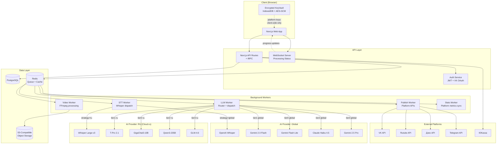
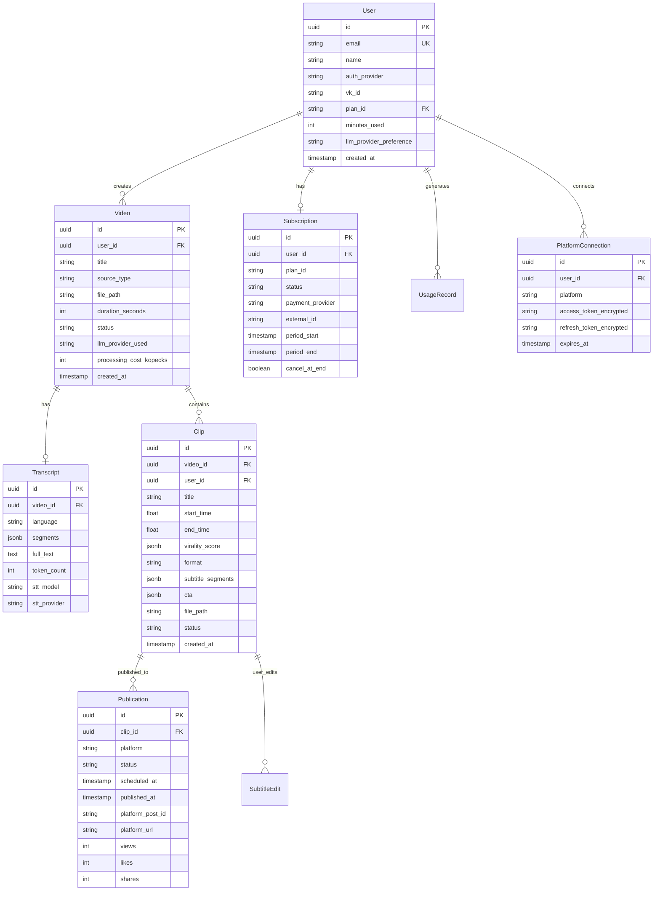

# КлипМейкер — Architecture

## Architecture Overview

### Architecture Style
**Distributed Monolith** in a **Monorepo** — services share codebase but run as separate Docker containers. Communication via shared PostgreSQL + Redis queue (no HTTP inter-service calls in MVP).

### High-Level Diagram



---

## Component Breakdown

### 1. Web Application (Next.js)
- **Framework:** Next.js 15 (App Router)
- **Rendering:** SSR for SEO pages (landing, blog), CSR for dashboard
- **State:** Zustand (light) or React Query (server state)
- **UI Library:** shadcn/ui + Tailwind CSS
- **Video Editor:** Custom React component with `<video>` + Canvas overlay
- **Encrypted KeyVault:** Web Crypto API + IndexedDB (platform API keys)
- **Real-time:** WebSocket for processing progress

### 2. API Layer (Next.js API Routes + tRPC)
- **Auth:** NextAuth.js (email + VK OAuth), JWT (15 min access, 7d refresh)
- **Validation:** Zod schemas
- **Rate limiting:** Redis-backed (100 req/min per user)
- **File upload:** Direct-to-S3 presigned URLs (bypass API for large files)
- **Billing webhook:** ЮKassa callback handler

### 3. Background Workers (BullMQ on Redis)
- **STT Worker:** Dispatches to Cloud.ru Whisper or OpenAI Whisper based on user strategy
- **LLM Worker:** Routes to correct provider/model via LLM Router algorithm
- **Video Worker:** FFmpeg subprocess for reframe, subtitles, watermark, CTA overlay
- **Publish Worker:** Platform API integration (VK, Rutube, Дзен, Telegram)
- **Stats Worker:** Periodic sync of publication metrics from platforms (cron, every 6h)

### 4. LLM Router (core component)

```
LLMRouter
├── ProviderRegistry
│   ├── CloudRuProvider (OpenAI-compatible client)
│   │   ├── models: T-Pro 2.1, GigaChat3-10B, Qwen3-235B, GLM-4.6, Whisper
│   │   └── config: base_url, api_key (server-side env)
│   └── GlobalProvider (multi-client)
│       ├── GoogleProvider (Gemini Flash, Flash Lite, 2.5 Pro)
│       ├── AnthropicProvider (Claude Haiku 4.5)
│       ├── OpenAIProvider (Whisper only)
│       └── config: api_keys from encrypted client storage (proxied) or server env
├── TierSelector (task + context → tier)
├── FallbackHandler (tier1 fail → tier2 retry)
├── CostTracker (log every LLM call cost)
└── PromptManager
    ├── moment_selection.prompt
    ├── virality_scoring.prompt
    ├── title_generation.prompt
    └── cta_suggestion.prompt
```

**Global Provider API Keys Strategy:**
- **Server-side keys (default):** КлипМейкер provides own API keys, cost included in subscription
- **BYOK (Bring Your Own Key):** User provides own Gemini/Claude/OpenAI keys → stored encrypted in browser → proxied through backend for API calls → backend never stores them, only passes through per-request

### 5. Data Layer
- **PostgreSQL:** Users, videos, clips, subscriptions, publications, usage records
- **Redis:** BullMQ job queues, session cache, rate limiting counters
- **S3-Compatible:** Video files, rendered clips, thumbnails (Yandex Object Storage or MinIO)

---

## Technology Stack

| Layer | Technology | Rationale |
|-------|-----------|-----------|
| **Frontend** | Next.js 15, React 19, TypeScript | SSR + CSR, monorepo friendly |
| **UI** | shadcn/ui, Tailwind CSS | Fast, accessible, customizable |
| **State** | React Query + Zustand | Server + client state separation |
| **API** | Next.js API Routes + tRPC | Type-safe, colocated with frontend |
| **Auth** | NextAuth.js + JWT | Email + VK OAuth, session management |
| **Queue** | BullMQ (Redis) | Reliable job processing, retries, priorities |
| **Database** | PostgreSQL 16 + Prisma ORM | Mature, reliable, great tooling |
| **Cache** | Redis 7 | Queue + cache + rate limiting |
| **Object Storage** | S3-compatible (Yandex OS / MinIO) | Video/clip storage, CDN-friendly |
| **Video Processing** | FFmpeg 7 (subprocess) | Industry standard, full feature set |
| **AI (RU)** | Cloud.ru Evolution FM | 152-ФЗ, OpenAI-compatible, T-Pro 2.1 |
| **AI (Global)** | Gemini API, Anthropic API, OpenAI API | Best models globally |
| **Payments** | ЮKassa + СБП | Standard Russian payment gateway |
| **Containerization** | Docker + Docker Compose | Simple, reproducible deploys |
| **Hosting** | VPS (AdminVPS / HOSTKEY) | Russian hosting, 152-ФЗ |
| **Reverse Proxy** | Nginx (or Traefik) | SSL termination, routing |
| **Monitoring** | Prometheus + Grafana | Metrics, dashboards, alerting |
| **Logging** | Pino + Loki | Structured JSON logs |
| **CI/CD** | GitHub Actions → SSH deploy | Simple, no K8s overhead |

---

## Data Architecture

### Database Schema (simplified ERD)



### Storage Strategy

| Data Type | Storage | Retention | Access Pattern |
|-----------|---------|-----------|----------------|
| User data | PostgreSQL | Permanent | CRUD, indexed by email/vk_id |
| Transcripts | PostgreSQL (JSONB) | With video | Read-heavy during processing |
| Video files | S3 | Free: 3 days, Paid: 30 days | Write once, read few |
| Rendered clips | S3 | Free: 3 days, Paid: 90 days | Write once, read many (CDN) |
| Thumbnails | S3 + CDN | With clips | Read-heavy |
| Job queue | Redis | Transient | High throughput |
| Rate limits | Redis | TTL-based | High throughput |

---

## Security Architecture

### Authentication Flow

```
1. Email signup → verification email → JWT
2. VK OAuth → callback → create/link user → JWT
3. JWT: access (15 min, HttpOnly cookie) + refresh (7 days, secure)
4. Rate limiting: 100 req/min per user, 10 uploads/hour, 5 auth attempts/min
```

### Platform API Keys Security (Client-Side)

```
User's platform API keys (VK, Telegram, etc.) flow:

[User enters key] → [Web Crypto API: AES-GCM 256-bit encrypt]
                  → [Store in IndexedDB]
                  → [When needed: decrypt in memory]
                  → [Send to backend per-request in encrypted header]
                  → [Backend: decrypt, use, discard — never store]
                  → [Auto-lock after 30 min inactivity]
```

### LLM API Keys Security

```
RU Strategy (Cloud.ru):
  - Server-side API key in env vars
  - All requests from backend → Cloud.ru API
  - User data stays in RF

Global Strategy:
  - Option A (default): КлипМейкер's own API keys (cost in subscription)
  - Option B (BYOK): User provides keys → encrypted client-side
    → proxied per-request → backend passes through, never stores
  - Data residency warning shown to user
```

### Data Residency

| Strategy | Data Location | Compliance |
|----------|--------------|------------|
| **RU (Cloud.ru)** | All data in RF | ✅ 152-ФЗ full compliance |
| **Global** | Video/clips in RF, transcripts sent to US/EU for LLM processing | ⚠️ User explicitly consents, transcripts only (no PII) |

---

## Scalability Considerations

### Horizontal Scaling Points

```
                    Load Balancer (nginx)
                         │
                    ┌────┴────┐
                    │ Web x2  │     ← stateless, scale horizontally
                    └────┬────┘
                         │
                    ┌────┴────┐
                    │ Redis   │     ← single instance (MVP), Redis Cluster later
                    └────┬────┘
                    ┌────┴────────────┐
              ┌─────┤ Workers         │
              │     │ STT x1-3       │     ← scale by queue depth
              │     │ LLM x1-3       │     ← scale by queue depth
              │     │ Video x2-5     │     ← CPU-heavy, main bottleneck
              │     │ Publish x1     │     ← rate-limited by platform APIs
              │     └─────────────────┘
              │
         ┌────┴────┐
         │ PG      │     ← single instance + PgBouncer (MVP)
         └─────────┘
```

### Bottleneck Analysis

| Bottleneck | At Scale | Mitigation |
|------------|----------|------------|
| Video processing (FFmpeg) | CPU-bound, ~2 min per video | Horizontal: add Video Workers |
| STT (API) | API rate limits | Multiple API keys, queue throttling |
| LLM (API) | API rate limits | Router fallback, multiple providers |
| Database | Connection limits | PgBouncer, read replicas (v2) |
| S3 bandwidth | Large file uploads | Direct-to-S3 presigned URLs |
| Platform APIs | Rate limits (VK: 5 req/sec) | Queue with throttle, batch posting |

---

## Docker Compose Architecture

```yaml
services:
  # Web + API (Next.js)
  web:
    build: ./apps/web
    ports: ["3000:3000"]
    depends_on: [postgres, redis]
    environment:
      - DATABASE_URL
      - REDIS_URL
      - CLOUDRU_API_KEY
      - YOOKASSA_SHOP_ID
      - NEXTAUTH_SECRET

  # Background Workers
  worker-stt:
    build: ./apps/worker
    command: ["node", "dist/workers/stt.js"]
    depends_on: [redis]

  worker-llm:
    build: ./apps/worker
    command: ["node", "dist/workers/llm.js"]
    depends_on: [redis]

  worker-video:
    build: ./apps/worker
    command: ["node", "dist/workers/video.js"]
    depends_on: [redis]
    # FFmpeg installed in image

  worker-publish:
    build: ./apps/worker
    command: ["node", "dist/workers/publish.js"]
    depends_on: [redis]

  # Data
  postgres:
    image: postgres:16-alpine
    volumes: ["pgdata:/var/lib/postgresql/data"]

  redis:
    image: redis:7-alpine
    volumes: ["redisdata:/data"]

  # Reverse proxy
  nginx:
    image: nginx:alpine
    ports: ["80:80", "443:443"]
    volumes: ["./nginx.conf:/etc/nginx/nginx.conf"]

volumes:
  pgdata:
  redisdata:
```

### Monorepo Structure

```
clipmaker/
├── apps/
│   ├── web/                    # Next.js app (frontend + API)
│   │   ├── app/                # App Router pages
│   │   │   ├── (auth)/         # Login, register
│   │   │   ├── (dashboard)/    # Dashboard, videos, clips
│   │   │   ├── (settings)/     # Profile, billing, integrations
│   │   │   └── api/            # API routes + tRPC
│   │   ├── components/         # React components
│   │   │   ├── editor/         # Video clip editor
│   │   │   ├── upload/         # Upload + URL paste
│   │   │   └── keyvault/       # Encrypted key management UI
│   │   └── lib/                # Shared utilities
│   │
│   └── worker/                 # Background workers
│       ├── workers/
│       │   ├── stt.ts          # STT dispatch (Cloud.ru / OpenAI)
│       │   ├── llm.ts          # LLM Router + dispatch
│       │   ├── video.ts        # FFmpeg processing
│       │   ├── publish.ts      # Platform API publishing
│       │   └── stats.ts        # Metrics sync cron
│       └── lib/
│           ├── llm-router.ts   # Core LLM routing logic
│           ├── providers/      # Provider adapters
│           │   ├── cloudru.ts
│           │   ├── google.ts
│           │   ├── anthropic.ts
│           │   └── openai.ts
│           └── prompts/        # LLM prompt templates
│
├── packages/
│   ├── db/                     # Prisma schema + client
│   ├── queue/                  # BullMQ job definitions
│   ├── types/                  # Shared TypeScript types
│   └── config/                 # Shared configuration
│
├── docker-compose.yml
├── docker-compose.prod.yml
├── Dockerfile.web
├── Dockerfile.worker
├── nginx.conf
├── .env.example
├── turbo.json                  # Turborepo config
└── package.json
```
