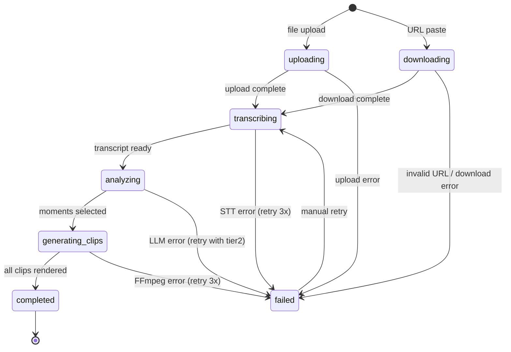
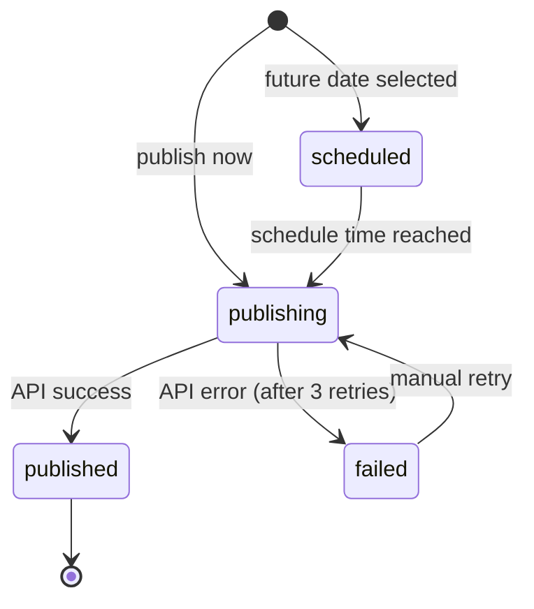

# КлипМейкер — Pseudocode

## Data Structures

### User

```
type User = {
  id: UUID
  email: string
  name: string | null
  avatar_url: string | null
  auth_provider: "email" | "vk"
  vk_id: string | null
  plan: Plan
  minutes_used: number          // current billing period
  minutes_limit: number         // from plan
  billing_period_start: Date
  llm_provider_preference: "ru" | "global"  // ← dual strategy
  created_at: Timestamp
  updated_at: Timestamp
}

type Plan = {
  id: "free" | "start" | "pro" | "business"
  name: string
  price_monthly: number         // kopecks
  minutes_per_month: number
  max_clips_per_video: number   // free=3, start=10, pro=unlimited
  watermark: boolean
  auto_post_platforms: string[] // free=[], start=["vk"], pro=["vk","rutube","dzen","telegram"]
  max_team_seats: number        // free=1, start=1, pro=3, business=10+
  llm_tier_max: number          // free=1, start=1, pro=2, business=2
}
```

### Video & Clips

```
type Video = {
  id: UUID
  user_id: UUID
  title: string
  source_type: "upload" | "url"
  source_url: string | null
  file_path: string             // S3 path
  duration_seconds: number
  status: VideoStatus
  transcript: Transcript | null
  llm_provider_used: "ru" | "global"  // ← which strategy was used
  processing_cost_kopecks: number
  created_at: Timestamp
}

type VideoStatus =
  | "uploading"
  | "downloading"         // URL source
  | "transcribing"
  | "analyzing"           // LLM moment selection
  | "generating_clips"    // FFmpeg processing
  | "completed"
  | "failed"

type Transcript = {
  id: UUID
  video_id: UUID
  language: "ru" | "en"
  segments: TranscriptSegment[]
  full_text: string
  token_count: number           // for LLM routing
  stt_model: string             // "whisper-large-v3"
  stt_provider: "cloudru" | "openai"
}

type TranscriptSegment = {
  start: number       // seconds
  end: number
  text: string
  confidence: number  // 0-1
}

type Clip = {
  id: UUID
  video_id: UUID
  user_id: UUID
  title: string
  description: string | null
  start_time: number            // seconds in source video
  end_time: number
  duration: number
  virality_score: ViralityScore
  format: "9:16" | "1:1" | "16:9"
  subtitle_segments: SubtitleSegment[]
  cta: CTA | null
  file_path: string | null      // S3 path after rendering
  thumbnail_path: string | null
  status: "pending" | "rendering" | "ready" | "published" | "failed"
  publications: Publication[]
  created_at: Timestamp
}

type ViralityScore = {
  total: number       // 0-100
  hook: number        // 0-25 (first 3 sec impact)
  engagement: number  // 0-25 (emotional/informational value)
  flow: number        // 0-25 (narrative completeness)
  trend: number       // 0-25 (topic relevance)
}

type SubtitleSegment = {
  start: number
  end: number
  text: string
  style: SubtitleStyle
}

type CTA = {
  text: string           // "Записаться на вебинар"
  url: string | null
  position: "end" | "overlay"
  duration: number       // seconds
}

type Publication = {
  id: UUID
  clip_id: UUID
  platform: "vk" | "rutube" | "dzen" | "telegram"
  status: "scheduled" | "publishing" | "published" | "failed"
  scheduled_at: Timestamp | null
  published_at: Timestamp | null
  platform_post_id: string | null
  platform_url: string | null
  views: number
  likes: number
  shares: number
  last_stats_sync: Timestamp | null
}
```

### LLM Provider Configuration

```
type LLMProviderStrategy = "ru" | "global"

type LLMProviderConfig = {
  ru: {
    stt: { provider: "cloudru", model: "whisper-large-v3", cost_per_sec: 0.005 }
    tier0: { provider: "cloudru", model: "GigaChat3-10B-A1.8B", cost_input: 10, cost_output: 10 }
    tier1: { provider: "cloudru", model: "t-tech/T-pro-it-2.1", cost_input: 35, cost_output: 70 }
    tier2: { provider: "cloudru", model: "Qwen3-235B-A22B-Instruct-2507", cost_input: 17, cost_output: 70 }
    tier3: { provider: "cloudru", model: "zai-org/GLM-4.6", cost_input: 55, cost_output: 220 }
    base_url: "https://api.cloud.ru/v1"
    data_residency: "RU"
  }
  global: {
    stt: { provider: "openai", model: "whisper-1", cost_per_min: 0.006_usd }
    tier0: { provider: "google", model: "gemini-2.0-flash-lite", cost_input: 0.075_usd, cost_output: 0.30_usd }
    tier1: { provider: "google", model: "gemini-2.0-flash", cost_input: 0.10_usd, cost_output: 0.40_usd }
    tier2: { provider: "anthropic", model: "claude-haiku-4.5", cost_input: 0.80_usd, cost_output: 4.00_usd }
    tier3: { provider: "google", model: "gemini-2.5-pro", cost_input: 1.25_usd, cost_output: 10.00_usd }
    base_url: varies_by_provider
    data_residency: "US/EU"
  }
}
```

### Billing

```
type Subscription = {
  id: UUID
  user_id: UUID
  plan_id: string
  status: "active" | "cancelled" | "past_due" | "expired"
  payment_provider: "yookassa"
  payment_method: "card" | "sbp"
  external_subscription_id: string
  current_period_start: Timestamp
  current_period_end: Timestamp
  cancel_at_period_end: boolean
  created_at: Timestamp
}

type UsageRecord = {
  id: UUID
  user_id: UUID
  video_id: UUID
  minutes_consumed: number
  llm_cost_kopecks: number
  stt_cost_kopecks: number
  gpu_cost_kopecks: number
  provider_strategy: "ru" | "global"
  created_at: Timestamp
}
```

---

## Core Algorithms

### Algorithm: LLM Router

```
INPUT: task: LLMTask, context: RoutingContext
OUTPUT: { provider, model, base_url, api_key }

type LLMTask = "transcription" | "moment_selection" | "virality_scoring" | "title_generation" | "cta_suggestion"
type RoutingContext = {
  strategy: "ru" | "global"
  video_duration_sec: number
  token_count: number
  user_plan: Plan
  previous_score: number | null   // for retry logic
}

STEPS:
1. config = LLMProviderConfig[context.strategy]

2. IF task == "transcription":
     RETURN config.stt

3. IF task IN ["title_generation", "cta_suggestion"]:
     RETURN config.tier0

4. IF context.token_count > 100_000 AND context.strategy == "ru":
     RETURN config.tier3    // GLM-4.6 200K context
   IF context.token_count > 100_000 AND context.strategy == "global":
     RETURN config.tier3    // Gemini 2.5 Pro 1M context

5. IF context.user_plan.id == "business" OR
     (context.previous_score != null AND context.previous_score < 50):
     RETURN config.tier2

6. RETURN config.tier1      // default: T-Pro 2.1 (ru) or Gemini Flash (global)

COMPLEXITY: O(1)
```

### Algorithm: Video Processing Pipeline

```
INPUT: video_id: UUID, user: User
OUTPUT: clips: Clip[]

STEPS:
1. video = db.getVideo(video_id)
   strategy = user.llm_provider_preference   // "ru" | "global"

2. TRANSCRIBE:
   stt_config = LLMRouter("transcription", { strategy, video_duration: video.duration })
   transcript = await STTService.transcribe(video.file_path, stt_config)
   db.saveTranscript(video_id, transcript)
   video.status = "transcribing" → "analyzing"

3. ANALYZE (moment selection):
   routing_ctx = {
     strategy,
     video_duration: video.duration,
     token_count: transcript.token_count,
     user_plan: user.plan,
     previous_score: null
   }
   llm_config = LLMRouter("moment_selection", routing_ctx)

   moments = await LLMService.selectMoments(transcript.full_text, llm_config)
   // Returns: [{ start, end, reason, hook_strength }]

   IF moments.length == 0:
     // Retry with tier2
     routing_ctx.previous_score = 0
     llm_config = LLMRouter("moment_selection", routing_ctx)
     moments = await LLMService.selectMoments(transcript.full_text, llm_config)

4. SCORE (virality scoring — parallel):
   llm_config = LLMRouter("virality_scoring", routing_ctx)
   scores = await Promise.all(
     moments.map(m => LLMService.scoreVirality(m, transcript, llm_config))
   )
   // Returns: ViralityScore for each moment

5. GENERATE TITLES + CTA (parallel, tier0):
   title_config = LLMRouter("title_generation", routing_ctx)
   cta_config = LLMRouter("cta_suggestion", routing_ctx)

   [titles, ctas] = await Promise.all([
     Promise.all(moments.map(m => LLMService.generateTitle(m, title_config))),
     Promise.all(moments.map(m => LLMService.suggestCTA(m, cta_config)))
   ])

6. CREATE CLIPS (parallel FFmpeg):
   clips = []
   FOR each moment, score, title, cta IN zip(moments, scores, titles, ctas):
     clip = db.createClip({
       video_id, user_id: user.id,
       start_time: moment.start, end_time: moment.end,
       title, virality_score: score, cta,
       status: "pending"
     })
     clips.push(clip)

   // Respect plan limits
   IF user.plan.max_clips_per_video < clips.length:
     clips = clips.sortBy(c => c.virality_score.total).slice(0, user.plan.max_clips_per_video)

7. RENDER (parallel FFmpeg workers):
   await Promise.all(clips.map(clip =>
     VideoProcessor.render(clip, {
       source: video.file_path,
       format: "9:16",
       subtitles: extractSubtitles(transcript, clip),
       watermark: user.plan.watermark,
       cta: clip.cta
     })
   ))

8. video.status = "completed"
   RETURN clips

COMPLEXITY: O(n) where n = number of clips
BOTTLENECK: STT transcription (~1 min for 60 min video) + LLM analysis (~15 sec)
```

### Algorithm: Auto-Post Scheduler

```
INPUT: clip_id: UUID, platforms: string[], schedule: Date | null
OUTPUT: publications: Publication[]

STEPS:
1. clip = db.getClip(clip_id)
   user = db.getUser(clip.user_id)

2. FOR each platform IN platforms:
     // Check user has platform connected
     connection = db.getPlatformConnection(user.id, platform)
     IF !connection: SKIP, notify user

     // Check plan allows this platform
     IF platform NOT IN user.plan.auto_post_platforms:
       SKIP, show upgrade prompt

     publication = db.createPublication({
       clip_id, platform,
       status: schedule ? "scheduled" : "publishing",
       scheduled_at: schedule
     })

     IF schedule == null:
       queue.add("publish", { publication_id: publication.id }, { priority: "high" })
     ELSE:
       queue.add("publish", { publication_id: publication.id }, { delay: schedule - now() })

3. RETURN publications

// Queue worker:
WORKER "publish":
  publication = db.getPublication(job.publication_id)
  clip = db.getClip(publication.clip_id)

  TRY:
    result = await PlatformAPI[publication.platform].publish(clip, user.connection)
    publication.status = "published"
    publication.platform_post_id = result.post_id
    publication.platform_url = result.url
    publication.published_at = now()
  CATCH error:
    IF job.attempts < 3:
      RETRY with exponential backoff (5min, 15min, 60min)
    ELSE:
      publication.status = "failed"
      notify(user, "Ошибка публикации в ${platform}")
```

### Algorithm: Encrypted Client-Side Key Storage

```
// Runs in browser only — keys NEVER touch the server

INPUT: platform_api_key: string, user_password: string
OUTPUT: stored encrypted key in IndexedDB

STEPS:
1. DERIVE MASTER KEY:
   salt = crypto.getRandomValues(new Uint8Array(16))
   key_material = await crypto.subtle.importKey("raw", encode(user_password), "PBKDF2", false, ["deriveKey"])
   master_key = await crypto.subtle.deriveKey(
     { name: "PBKDF2", salt, iterations: 100_000, hash: "SHA-256" },
     key_material,
     { name: "AES-GCM", length: 256 },
     false,
     ["encrypt", "decrypt"]
   )

2. ENCRYPT:
   iv = crypto.getRandomValues(new Uint8Array(12))
   encrypted = await crypto.subtle.encrypt(
     { name: "AES-GCM", iv },
     master_key,
     encode(platform_api_key)
   )

3. STORE in IndexedDB:
   db.put("platform_keys", {
     platform: "vk",
     encrypted_key: encrypted,
     iv: iv,
     salt: salt,
     created_at: Date.now()
   })

4. AUTO-LOCK after 30 min inactivity:
   master_key = null  // cleared from memory
   // User must re-enter password to decrypt

NOTES:
- Master key exists ONLY in browser memory
- Server never sees plaintext API keys
- User can export/import encrypted backup
```

---

## API Contracts

### POST /api/videos/upload

```
Request:
  Headers: { Authorization: Bearer <jwt> }
  Body: multipart/form-data { file: Video (max 4GB) }

Response (201):
  {
    "data": {
      "id": "uuid",
      "status": "uploading",
      "title": "filename.mp4",
      "duration": null
    }
  }

Response (413): { "error": { "code": "FILE_TOO_LARGE", "message": "Максимальный размер: 4 ГБ" } }
Response (400): { "error": { "code": "INVALID_FORMAT", "message": "Поддерживаемые форматы: MP4, WebM, MOV, AVI" } }
Response (402): { "error": { "code": "MINUTES_EXCEEDED", "message": "Недостаточно минут", "minutes_remaining": 5 } }
```

### POST /api/videos/from-url

```
Request:
  Headers: { Authorization: Bearer <jwt> }
  Body: { "url": "https://youtube.com/watch?v=..." }

Response (201):
  {
    "data": {
      "id": "uuid",
      "status": "downloading",
      "source_url": "https://..."
    }
  }

Response (400): { "error": { "code": "UNSUPPORTED_URL", "message": "Поддерживаемые: YouTube, VK Видео, Rutube" } }
```

### GET /api/videos/:id/clips

```
Request:
  Headers: { Authorization: Bearer <jwt> }

Response (200):
  {
    "data": [
      {
        "id": "uuid",
        "title": "Как увеличить продажи в 3 раза",
        "start_time": 1234.5,
        "end_time": 1278.3,
        "duration": 43.8,
        "virality_score": { "total": 82, "hook": 23, "engagement": 21, "flow": 19, "trend": 19 },
        "format": "9:16",
        "status": "ready",
        "thumbnail_url": "https://...",
        "download_url": "https://...",
        "publications": []
      }
    ],
    "meta": { "total": 8, "video_status": "completed" }
  }

Response (202): { "data": [], "meta": { "video_status": "analyzing", "progress": 65, "eta_seconds": 45 } }
```

### POST /api/clips/:id/publish

```
Request:
  Headers: { Authorization: Bearer <jwt> }
  Body: {
    "platforms": ["vk", "telegram"],
    "schedule_at": "2026-03-01T10:00:00+03:00" | null
  }

Response (201):
  {
    "data": [
      { "id": "uuid", "platform": "vk", "status": "scheduled", "scheduled_at": "..." },
      { "id": "uuid", "platform": "telegram", "status": "publishing" }
    ]
  }

Response (403): { "error": { "code": "PLATFORM_NOT_IN_PLAN", "message": "Авто-постинг в Telegram доступен на тарифе Pro" } }
Response (400): { "error": { "code": "PLATFORM_NOT_CONNECTED", "message": "Подключите VK в Настройки > Интеграции" } }
```

### PATCH /api/users/me/settings

```
Request:
  Headers: { Authorization: Bearer <jwt> }
  Body: {
    "llm_provider_preference": "ru" | "global"
  }

Response (200):
  {
    "data": {
      "llm_provider_preference": "global",
      "data_residency_warning": "При выборе Global данные видео обрабатываются серверами за пределами РФ"
    }
  }
```

### GET /api/users/me/usage

```
Request:
  Headers: { Authorization: Bearer <jwt> }

Response (200):
  {
    "data": {
      "plan": "pro",
      "minutes_used": 187,
      "minutes_limit": 300,
      "minutes_remaining": 113,
      "billing_period_end": "2026-03-15T00:00:00Z",
      "llm_provider": "ru",
      "processing_costs": {
        "total_kopecks": 4520,
        "stt_kopecks": 2100,
        "llm_kopecks": 1800,
        "gpu_kopecks": 620
      }
    }
  }
```

### PATCH /api/clips/:id

```
Request:
  Headers: { Authorization: Bearer <jwt> }
  Body: {
    "title": "Новый заголовок",                    // optional
    "start_time": 1234.5,                           // optional (trim)
    "end_time": 1278.3,                             // optional (trim)
    "subtitle_edits": [                             // optional
      { "index": 3, "text": "Исправленный текст" }
    ],
    "cta": { "text": "Записаться", "url": "..." }  // optional
  }

Response (200):
  {
    "data": {
      "id": "uuid",
      "title": "Новый заголовок",
      "start_time": 1234.5,
      "end_time": 1278.3,
      "status": "rendering",
      "message": "Клип обновлён. Рендеринг ~30 сек"
    }
  }

Response (400): { "error": { "code": "INVALID_TIMECODES", "message": "end_time должен быть больше start_time" } }
Response (409): { "error": { "code": "CLIP_RENDERING", "message": "Клип уже рендерится. Дождитесь завершения" } }
```

### GET /api/clips/:id/download

```
Request:
  Headers: { Authorization: Bearer <jwt> }

Response (302):
  Redirect to presigned S3 URL (valid 1 hour)
  Headers: { Location: "https://s3.../clip-uuid.mp4?signature=..." }

Response (404): { "error": { "code": "CLIP_NOT_READY", "message": "Клип ещё рендерится" } }
Response (402): { "error": { "code": "PLAN_EXPIRED", "message": "Подписка истекла" } }
```

### POST /api/billing/checkout

```
Request:
  Headers: { Authorization: Bearer <jwt> }
  Body: {
    "plan_id": "start" | "pro" | "business",
    "payment_method": "card" | "sbp",
    "return_url": "https://clipmaker.ru/settings/billing"
  }

Response (200):
  {
    "data": {
      "confirmation_url": "https://yookassa.ru/...",   // redirect user here
      "payment_id": "yookassa-uuid"
    }
  }
```

### POST /api/billing/webhook (ЮKassa callback)

```
Request:
  Headers: { Content-Type: application/json }
  Body: { ЮKassa webhook payload }

Processing:
  1. Verify IP whitelist (ЮKassa IPs)
  2. Check idempotency (payment_id dedup)
  3. On "payment.succeeded": activate subscription, reset minutes
  4. On "payment.canceled": mark subscription as past_due
  5. On "refund.succeeded": downgrade to free plan

Response (200): { "status": "ok" }
```

### GET /api/billing/subscription

```
Request:
  Headers: { Authorization: Bearer <jwt> }

Response (200):
  {
    "data": {
      "plan": "pro",
      "status": "active",
      "payment_method": "card",
      "current_period_end": "2026-04-15T00:00:00Z",
      "cancel_at_period_end": false,
      "next_charge": { "amount_kopecks": 199000, "date": "2026-04-15" }
    }
  }
```

---

## State Transitions

### Video Processing State Machine



### Publication State Machine



---

## Error Handling Strategy

| Error Category | Status Code | Retry | User Message |
|---------------|-------------|-------|-------------|
| **Auth** | 401 | No | "Сессия истекла. Войдите снова" |
| **Plan limit** | 402 | No | "Минуты исчерпаны. Обновите тариф" |
| **Validation** | 400 | No | Specific field error |
| **Not found** | 404 | No | "Видео не найдено" |
| **Rate limit** | 429 | Yes (backoff) | "Слишком много запросов. Подождите" |
| **STT fail** | 502 | Yes (3x) | "Ошибка распознавания. Повторяем..." |
| **LLM fail** | 502 | Yes (fallback to tier2) | "Ошибка AI. Пробуем другую модель..." |
| **Platform API** | 502 | Yes (3x, backoff) | "Ошибка публикации. Повторим через 5 мин" |
| **FFmpeg crash** | 500 | Yes (3x) | "Ошибка рендеринга. Повторяем..." |
| **Server error** | 500 | No | "Внутренняя ошибка. Мы уже знаем" |
