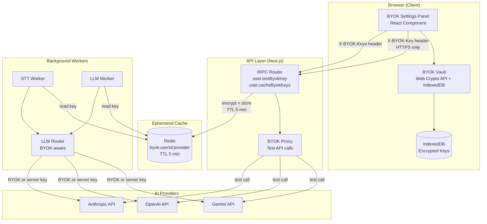
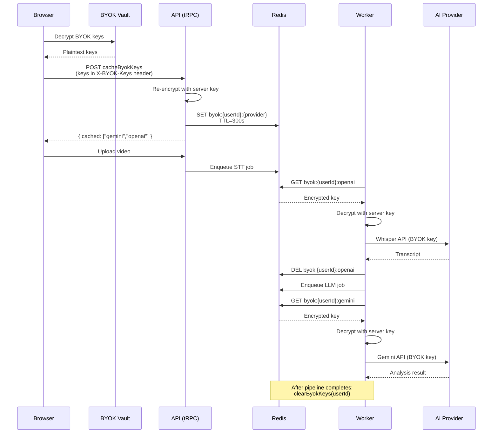

# Architecture: BYOK Key Management

## Architecture Overview

BYOK integrates into the existing Distributed Monolith architecture as a cross-cutting concern touching the client (Web Crypto + IndexedDB), API layer (tRPC endpoints), and worker layer (Redis cache + LLM Router).

### Component Diagram



### Data Flow: Video Processing with BYOK



---

## Component Breakdown

### 1. Client: BYOK Vault (`apps/web/lib/crypto/byok-vault.ts`)

**Responsibilities:**
- PBKDF2 key derivation from user password
- AES-GCM encrypt/decrypt operations
- IndexedDB CRUD for encrypted keys
- Auto-lock timer management
- Salt generation and persistence

**Dependencies:**
- Web Crypto API (browser-native)
- IndexedDB (browser-native)
- No external packages required

**Constraints:**
- Requires HTTPS (Web Crypto API unavailable on HTTP)
- Master key exists only in memory (closure)
- Salt stored in IndexedDB (not secret, required for PBKDF2)

### 2. Client: BYOK Settings Panel (`apps/web/components/settings/byok-keys-panel.tsx`)

**Responsibilities:**
- Display provider cards with status
- Handle key input, validation, storage
- Vault lock/unlock UI
- Help links per provider

**Dependencies:**
- BYOK Vault module
- tRPC client (for test key endpoint)
- shadcn/ui components

### 3. API: tRPC Mutations (`apps/web/lib/trpc/routers/user.ts`)

**New mutations:**
- `user.testByokKey` -- receive key in header, test against provider API, return result
- `user.cacheByokKeys` -- receive keys in header, encrypt with server key, store in Redis with TTL

**Dependencies:**
- `packages/crypto/src/token.ts` (server-side encryption)
- Redis client
- HTTP client for provider API calls

### 4. Worker: BYOK-Aware LLM Router (`apps/worker/lib/llm-router.ts`)

**Modifications:**
- `complete()` accepts optional `byokKeys` parameter
- `getClient()` creates ephemeral client with BYOK key (no caching)
- Fallback: if BYOK key fails (401/403), retry with server key

### 5. Worker: BYOK Key Retrieval (`apps/worker/lib/byok-cache.ts`)

**New module:**
- `getByokKey(userId, provider)` -- read from Redis, decrypt, return plaintext
- `peekByokKey(userId, provider)` -- read without delete (for multi-call pipeline)
- `clearByokKeys(userId)` -- clean up all BYOK keys for user

**Dependencies:**
- Redis client
- `packages/crypto/src/token.ts` (decrypt)

---

## Technology Choices

| Component | Technology | Rationale |
|-----------|-----------|-----------|
| Client-side encryption | Web Crypto API (AES-GCM) | Browser-native, no bundle size impact, auditable |
| Key derivation | PBKDF2 (Web Crypto API) | Standard, 100K+ iterations, SHA-256 |
| Client-side storage | IndexedDB | Persistent, large capacity, same-origin isolated |
| Key transport | HTTPS custom header | Clean separation from body, easy to filter from logs |
| Server-side cache | Redis (encrypted, TTL) | Already in stack, volatile, TTL auto-cleanup |
| Server-side encryption | AES-256-GCM (Node crypto) | Existing `packages/crypto` module, reuse code |

---

## Security Architecture

### Zero-Trust Key Handling

```
Principle: The server NEVER stores a user's plaintext API key persistently.

1. Client → Server: Key travels in HTTPS header (encrypted in transit by TLS)
2. Server processes:
   a. For test: extract, call provider API, discard immediately
   b. For caching: extract, encrypt with PLATFORM_TOKEN_SECRET, store in Redis (TTL 5 min)
3. Worker retrieves: decrypt from Redis, use for API call, delete from Redis
4. Never logged: X-BYOK-Key header excluded from request logging
5. Never in DB: PostgreSQL never sees BYOK keys
6. Auto-cleanup: Redis TTL ensures keys disappear even if pipeline crashes
```

### Header Security

```
nginx.conf additions:
  # Strip BYOK headers from upstream logs
  proxy_set_header X-BYOK-Key "";     # after forwarding to app
  proxy_set_header X-BYOK-Keys "";
  # Never log these headers
  log_format main escape=json '... (no X-BYOK-Key) ...';
```

### Memory Safety

```
Client-side:
  - Master key in closure (not window/global)
  - On lock: masterKey = null (GC collects CryptoKey)
  - Plaintext key: used briefly for encrypt/decrypt, then GC'd

Server-side:
  - Plaintext key extracted from header into local variable
  - Used for API call
  - Variable goes out of scope → GC'd
  - No assignment to module-level or persistent state
```

---

## Consistency with Project Architecture

| Architecture Principle | BYOK Compliance |
|----------------------|-----------------|
| "Encrypted KeyVault: Web Crypto API + IndexedDB" | Matches exactly |
| "BYOK: encrypted in browser, proxied per-request" | Matches exactly |
| "Server NEVER stores plaintext keys" | Enforced via Redis TTL + encryption |
| "PBKDF2 key derivation (100K+ iterations)" | 100,000 iterations, SHA-256 |
| "Auto-lock after 30 min inactivity" | Timer-based, clears master key |
| "AES-GCM 256-bit client-side only" | Web Crypto API, IndexedDB storage |
| Existing `packages/crypto/src/token.ts` | Reused for server-side Redis encryption |
| BullMQ async workers | BYOK keys cached in Redis for worker access |
