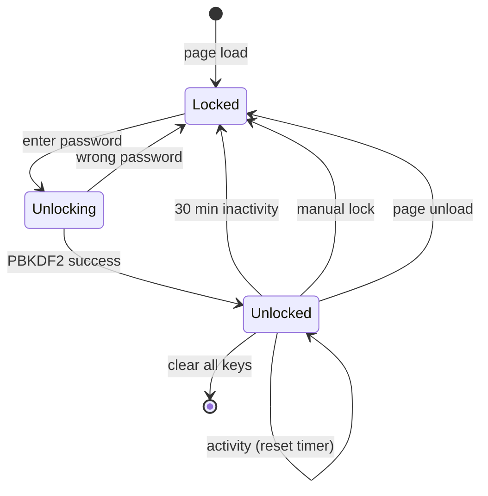
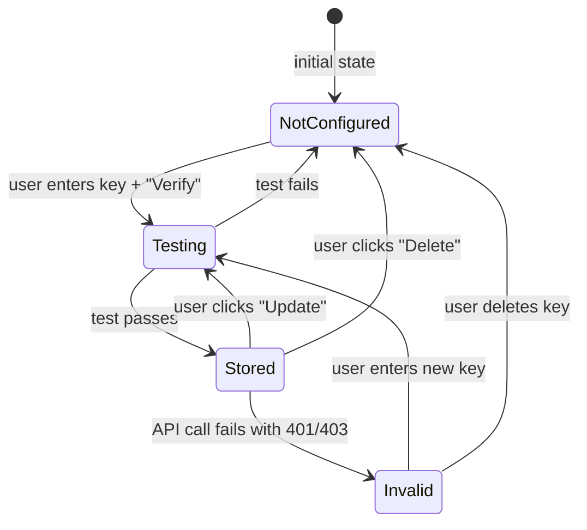

# Pseudocode: BYOK Key Management

## Data Structures

### BYOK Types

```typescript
type ByokProvider = 'gemini' | 'openai' | 'anthropic';

type ByokKeyStatus = 'connected' | 'not_connected' | 'invalid';

type EncryptedByokKey = {
  provider: ByokProvider;
  encryptedData: ArrayBuffer;  // AES-GCM ciphertext
  iv: Uint8Array;              // 12 bytes, unique per encryption
  salt: Uint8Array;            // 16 bytes, unique per user
  createdAt: number;           // timestamp
  keyPreview: string;          // first 4 + last 4 chars (e.g., "AIza...k7Gw")
};

type VaultState = {
  isLocked: boolean;
  masterKey: CryptoKey | null;  // null when locked
  lastActivity: number;         // timestamp for auto-lock
  keys: Map<ByokProvider, EncryptedByokKey>;
};

// Provider info for UI
type ByokProviderInfo = {
  id: ByokProvider;
  name: string;                  // "Gemini", "OpenAI", "Anthropic"
  description: string;           // Russian description
  helpUrl: string;               // "Where to get key?" link
  keyPrefix: string;             // expected prefix for validation hint
};

// Redis cache entry (server-side)
type ByokRedisEntry = {
  encryptedKey: string;          // AES-256-GCM encrypted with server key
  provider: ByokProvider;
  userId: string;
};
```

### Provider Configuration

```typescript
const BYOK_PROVIDERS: Record<ByokProvider, ByokProviderInfo> = {
  gemini: {
    id: 'gemini',
    name: 'Gemini',
    description: 'Google AI Studio -- для Gemini Flash, Flash Lite, 2.5 Pro',
    helpUrl: 'https://aistudio.google.com/apikey',
    keyPrefix: 'AIza',
  },
  openai: {
    id: 'openai',
    name: 'OpenAI',
    description: 'OpenAI -- для Whisper STT (Global стратегия)',
    helpUrl: 'https://platform.openai.com/api-keys',
    keyPrefix: 'sk-',
  },
  anthropic: {
    id: 'anthropic',
    name: 'Anthropic',
    description: 'Anthropic -- для Claude Haiku (Tier 2 fallback)',
    helpUrl: 'https://console.anthropic.com/settings/keys',
    keyPrefix: 'sk-ant-',
  },
};
```

---

## Core Algorithms

### Algorithm 1: BYOK Vault -- Derive Master Key

```
INPUT: password: string
OUTPUT: masterKey: CryptoKey

STEPS:
1. salt = loadSalt() OR crypto.getRandomValues(new Uint8Array(16))
2. keyMaterial = crypto.subtle.importKey(
     "raw",
     new TextEncoder().encode(password),
     "PBKDF2",
     false,
     ["deriveKey"]
   )
3. masterKey = crypto.subtle.deriveKey(
     { name: "PBKDF2", salt, iterations: 100_000, hash: "SHA-256" },
     keyMaterial,
     { name: "AES-GCM", length: 256 },
     false,       // not extractable
     ["encrypt", "decrypt"]
   )
4. storeSalt(salt)  // persist salt in IndexedDB (not secret)
5. startAutoLockTimer(30 * 60 * 1000)
6. RETURN masterKey

COMPLEXITY: O(1), ~200-400ms for PBKDF2
```

### Algorithm 2: BYOK Vault -- Encrypt Key

```
INPUT: apiKey: string, masterKey: CryptoKey
OUTPUT: EncryptedByokKey

STEPS:
1. iv = crypto.getRandomValues(new Uint8Array(12))  // unique per operation
2. plaintextBytes = new TextEncoder().encode(apiKey)
3. encryptedData = crypto.subtle.encrypt(
     { name: "AES-GCM", iv },
     masterKey,
     plaintextBytes
   )
4. keyPreview = apiKey.slice(0, 4) + "..." + apiKey.slice(-4)
5. RETURN {
     encryptedData,
     iv,
     salt: currentSalt,
     createdAt: Date.now(),
     keyPreview,
   }

COMPLEXITY: O(n) where n = key length (~50 bytes), <50ms
```

### Algorithm 3: BYOK Vault -- Decrypt Key

```
INPUT: encrypted: EncryptedByokKey, masterKey: CryptoKey
OUTPUT: plaintext API key string

STEPS:
1. decryptedBytes = crypto.subtle.decrypt(
     { name: "AES-GCM", iv: encrypted.iv },
     masterKey,
     encrypted.encryptedData
   )
2. plaintext = new TextDecoder().decode(decryptedBytes)
3. RETURN plaintext

ERRORS:
- DOMException (OperationError) → wrong password / corrupted data
- Handle gracefully: "Неверный пароль. Попробуйте снова"

COMPLEXITY: O(n), <50ms
```

### Algorithm 4: Auto-Lock Timer

```
STATE: timerId: number | null, lockTimeoutMs: 30 * 60 * 1000

ON_ACTIVITY (mousemove, keydown, click, touchstart):
  IF timerId: clearTimeout(timerId)
  timerId = setTimeout(lockVault, lockTimeoutMs)

ON_VISIBILITY_CHANGE:
  IF document.hidden:
    // Page hidden -- keep timer running
  ELSE:
    // Page visible -- check if we should already be locked
    IF lastActivity + lockTimeoutMs < Date.now():
      lockVault()

lockVault():
  masterKey = null
  timerId = null
  // Overwrite sensitive data
  notify("Хранилище заблокировано")
```

### Algorithm 5: IndexedDB Operations

```
DB_NAME = "clipmaker-byok"
STORE_NAME = "keys"
DB_VERSION = 1

storeKey(provider: ByokProvider, encrypted: EncryptedByokKey):
  db = await openDB(DB_NAME, DB_VERSION)
  tx = db.transaction(STORE_NAME, "readwrite")
  tx.objectStore(STORE_NAME).put({ ...encrypted, provider }, provider)
  await tx.done

getKey(provider: ByokProvider): EncryptedByokKey | null:
  db = await openDB(DB_NAME, DB_VERSION)
  result = await db.get(STORE_NAME, provider)
  RETURN result ?? null

deleteKey(provider: ByokProvider):
  db = await openDB(DB_NAME, DB_VERSION)
  tx = db.transaction(STORE_NAME, "readwrite")
  tx.objectStore(STORE_NAME).delete(provider)
  await tx.done

getAllKeys(): EncryptedByokKey[]:
  db = await openDB(DB_NAME, DB_VERSION)
  RETURN db.getAll(STORE_NAME)

getSalt(): Uint8Array | null:
  db = await openDB(DB_NAME, DB_VERSION)
  result = await db.get("meta", "salt")
  RETURN result?.value ?? null

storeSalt(salt: Uint8Array):
  db = await openDB(DB_NAME, DB_VERSION)
  tx = db.transaction("meta", "readwrite")
  tx.objectStore("meta").put({ id: "salt", value: salt }, "salt")
  await tx.done
```

### Algorithm 6: Key Validation (Test API Call)

```
INPUT: provider: ByokProvider, apiKey: string
OUTPUT: { valid: boolean, error?: string }

STEPS:
1. SWITCH provider:
   CASE "gemini":
     response = fetch("https://generativelanguage.googleapis.com/v1beta/models?key=" + apiKey)
     IF response.status === 200: RETURN { valid: true }
     IF response.status === 400 OR 403: RETURN { valid: false, error: "Недействительный ключ" }

   CASE "openai":
     response = fetch("https://api.openai.com/v1/models", {
       headers: { "Authorization": "Bearer " + apiKey }
     })
     IF response.status === 200: RETURN { valid: true }
     IF response.status === 401: RETURN { valid: false, error: "Недействительный ключ" }

   CASE "anthropic":
     response = fetch("https://api.anthropic.com/v1/messages", {
       method: "POST",
       headers: {
         "x-api-key": apiKey,
         "anthropic-version": "2023-06-01",
         "Content-Type": "application/json"
       },
       body: JSON.stringify({
         model: "claude-haiku-4.5-20250501",
         max_tokens: 1,
         messages: [{ role: "user", content: "Hi" }]
       })
     })
     IF response.status === 200: RETURN { valid: true }
     IF response.status === 401: RETURN { valid: false, error: "Недействительный ключ" }

2. ON timeout (>10s): RETURN { valid: false, error: "Таймаут. Попробуйте позже" }
3. ON network error: RETURN { valid: false, error: "Ошибка сети. Проверьте подключение" }

NOTE: This runs on the SERVER (tRPC mutation) to avoid CORS issues.
The client sends the key in X-BYOK-Key header, server extracts and tests.
```

### Algorithm 7: Server-Side BYOK Key Cache (Redis)

```
INPUT: userId: string, provider: ByokProvider, plaintextKey: string
OUTPUT: void

// Store (called when user triggers video processing)
cacheByokKey(userId, provider, plaintextKey):
  redisKey = "byok:" + userId + ":" + provider
  encrypted = encryptToken(plaintextKey, process.env.PLATFORM_TOKEN_SECRET)
  redis.set(redisKey, encrypted, "EX", 300)  // 5 min TTL

// Retrieve (called by worker)
getByokKey(userId, provider): string | null:
  redisKey = "byok:" + userId + ":" + provider
  encrypted = redis.get(redisKey)
  IF !encrypted: RETURN null
  plaintext = decryptToken(encrypted, process.env.PLATFORM_TOKEN_SECRET)
  redis.del(redisKey)  // delete after use
  RETURN plaintext

// Retrieve without delete (for pipeline with multiple calls)
peekByokKey(userId, provider): string | null:
  redisKey = "byok:" + userId + ":" + provider
  encrypted = redis.get(redisKey)
  IF !encrypted: RETURN null
  RETURN decryptToken(encrypted, process.env.PLATFORM_TOKEN_SECRET)

// Cleanup (called after pipeline completes)
clearByokKeys(userId):
  FOR provider IN ["gemini", "openai", "anthropic"]:
    redis.del("byok:" + userId + ":" + provider)
```

### Algorithm 8: Modified LLM Router with BYOK

```
// In LLMRouter.getClient(), add BYOK key support:

getClient(strategy, provider, byokKey?):
  IF strategy === "ru":
    // Cloud.ru always uses server key
    RETURN createClient(cloudruApiKey, LLM_PROVIDERS.ru.baseUrl)

  IF byokKey:
    // Use BYOK key for this request (do NOT cache client)
    RETURN createClient(byokKey, getBaseUrl(provider))

  // Fallback to server key
  RETURN createClient(serverKeys[provider], getBaseUrl(provider))

// Modified complete() method:
complete(context, messages, options, byokKeys?):
  tier = selectTier(context)
  modelConfig = getModelConfig(context.strategy, tier)

  // Get BYOK key for this specific provider
  byokKey = byokKeys?.[modelConfig.provider]
  client = getClient(context.strategy, modelConfig.provider, byokKey)

  TRY:
    response = client.chat.completions.create(...)
    RETURN response
  CATCH error:
    IF byokKey AND (error.status === 401 OR error.status === 403):
      // BYOK key rejected, fallback to server key
      logger.warn("BYOK key rejected, falling back to server key")
      client = getClient(context.strategy, modelConfig.provider)  // no byokKey
      RETURN client.chat.completions.create(...)
    THROW error
```

---

## API Contracts

### POST /api/trpc/user.testByokKey

```
Request:
  Headers: {
    Authorization: Bearer <jwt>,
    X-BYOK-Key: <plaintext-api-key>
  }
  Body: { provider: "gemini" | "openai" | "anthropic" }

Response (200):
  { "result": { "data": { "valid": true, "provider": "gemini" } } }

Response (200, invalid key):
  { "result": { "data": { "valid": false, "error": "Недействительный ключ" } } }

Response (400):
  { "error": { "message": "Missing X-BYOK-Key header" } }

Response (429):
  { "error": { "message": "Слишком много запросов. Подождите" } }
```

### POST /api/trpc/user.cacheByokKeys

```
Request:
  Headers: {
    Authorization: Bearer <jwt>,
    X-BYOK-Keys: <JSON: { gemini?: string, openai?: string, anthropic?: string }>
  }
  Body: {} (empty -- keys are in header)

Response (200):
  { "result": { "data": { "cached": ["gemini", "openai"], "ttl": 300 } } }

Response (400):
  { "error": { "message": "No valid keys provided" } }

NOTE: This endpoint caches BYOK keys in Redis before triggering video processing.
The client calls this BEFORE the video upload to ensure keys are available for workers.
```

---

## State Transitions

### Vault State Machine



### BYOK Key Lifecycle



---

## Error Handling Strategy

| Error | Handler | User Message |
|-------|---------|-------------|
| Wrong vault password | Retry (max 5 attempts) | "Неверный пароль" |
| IndexedDB unavailable | Disable BYOK, show warning | "Хранилище недоступно в этом браузере" |
| BYOK key rejected (401/403) | Fallback to server key | "Ваш ключ отклонен. Использован резервный" |
| BYOK key rate limited (429) | Retry with backoff, then fallback | "Превышен лимит вашего ключа. Повтор через X сек" |
| Network error during test | Show retry option | "Ошибка сети. Попробуйте позже" |
| Redis cache miss (no BYOK) | Use server key | (silent fallback, no user notification) |
| Encryption failure | Show error, do not store | "Ошибка шифрования. Попробуйте снова" |
| HTTPS not available | Block vault operations | "BYOK ключи требуют HTTPS-соединения" |
