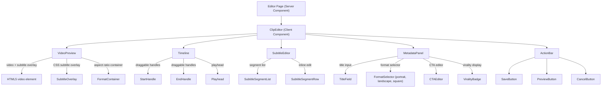
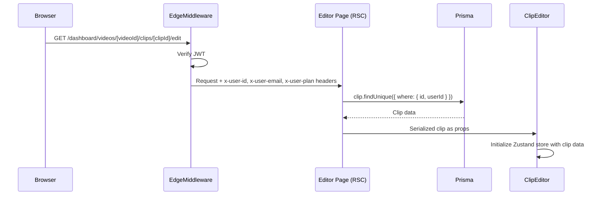
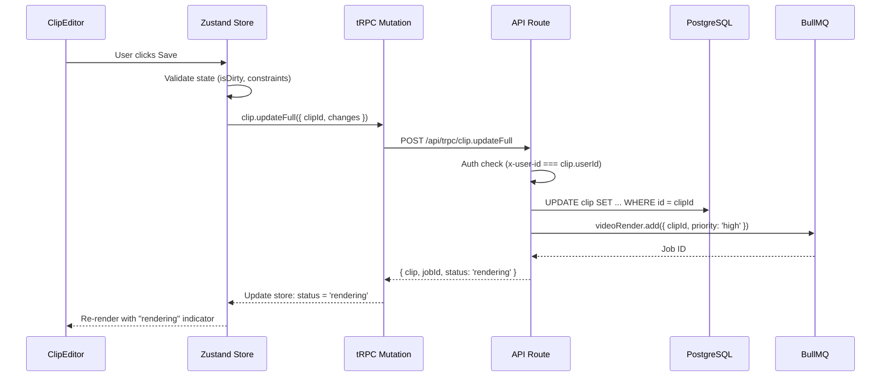

# Architecture: Clip Editor

## 1. Component Architecture



### Component Responsibilities

| Component | Type | Responsibility |
|-----------|------|----------------|
| Editor Page | Server Component | Auth check via headers, Prisma fetch, serialize clip data, pass as props |
| ClipEditor | Client Component (`'use client'`) | Orchestrator: initializes Zustand store, coordinates child components |
| VideoPreview | Client Component | HTML5 `<video>` playback, CSS subtitle overlay, aspect ratio container |
| Timeline | Client Component | Visual trim control with draggable start/end handles, playhead sync |
| SubtitleEditor | Client Component | List of subtitle segments with inline text editing |
| MetadataPanel | Client Component | Title, format (ClipFormat), CTA, virality score display |
| ActionBar | Client Component | Save (triggers re-render), preview toggle, cancel (discard changes) |

## 2. Data Flow

### Server-to-Client Flow



### Save Flow (Client-to-Server)



### Render Status Polling

```
ClipEditor → setInterval(3s) → tRPC clip.get({ clipId }) → check status
  - 'rendering' → show spinner
  - 'ready' → refresh preview URL
  - 'failed' → show error + retry button
```

No WebSocket needed. Simple polling after save with 3-second interval, auto-stop after status resolves.

## 3. File Structure

```
apps/web/
├── app/(dashboard)/dashboard/videos/[videoId]/clips/[clipId]/edit/
│   ├── page.tsx          # Server Component — auth via headers, Prisma fetch, props pass
│   ├── loading.tsx       # Skeleton UI (video placeholder + form shimmer)
│   ├── error.tsx         # Error boundary with "retry" / "go back" actions
│   └── not-found.tsx     # 404 — clip not found or unauthorized
├── components/clip-editor/
│   ├── clip-editor.tsx   # Main client orchestrator ('use client'), initializes store
│   ├── video-preview.tsx # HTML5 <video> + CSS subtitle overlay + format container
│   ├── timeline.tsx      # Draggable trim handles, playhead, time display
│   ├── subtitle-editor.tsx   # Subtitle segment list with inline editing
│   ├── metadata-panel.tsx    # Title, format selector, CTA editor, virality badge
│   └── action-bar.tsx        # Save, preview, cancel buttons with state awareness
└── lib/stores/
    └── clip-editor-store.ts  # Zustand store for all editor state
```

## 4. State Management

### Zustand Store Design

```typescript
// apps/web/lib/stores/clip-editor-store.ts

type ClipEditorState = {
  // Original data (for isDirty comparison)
  original: SerializedClip | null;

  // Editable fields
  title: string;
  startTime: number;        // seconds
  endTime: number;          // seconds
  format: ClipFormat;        // 'portrait' | 'landscape' | 'square'
  subtitles: SubtitleSegment[];
  subtitleStyle: SubtitleStyle;
  cta: CTA | null;

  // UI state
  status: ClipStatus;        // 'pending' | 'rendering' | 'ready' | 'published' | 'failed'
  isDirty: boolean;
  isSaving: boolean;
  currentTime: number;       // video playhead position
  isPlaying: boolean;

  // Actions
  initialize: (clip: SerializedClip) => void;
  setTitle: (title: string) => void;
  setTrimRange: (start: number, end: number) => void;
  setFormat: (format: ClipFormat) => void;
  updateSubtitle: (index: number, segment: SubtitleSegment) => void;
  removeSubtitle: (index: number) => void;
  setCTA: (cta: CTA | null) => void;
  setSubtitleStyle: (style: SubtitleStyle) => void;
  setCurrentTime: (time: number) => void;
  setIsPlaying: (playing: boolean) => void;
  reset: () => void;         // revert to original
  getChanges: () => Partial<ClipUpdateInput>;  // diff for save
};
```

### Key Design Decisions

- **Zustand over Context**: Avoids unnecessary re-renders; selectors enable granular subscriptions.
- **isDirty tracking**: Computed by deep comparison of current state vs `original`. Prevents redundant save requests.
- **Optimistic updates**: On save, immediately set `status = 'rendering'` and `isSaving = true` before server responds.
- **Reset capability**: `reset()` restores all fields from `original`, allowing "cancel edits" without refetch.

## 5. API Integration

### Existing tRPC Endpoints (used as-is)

| Endpoint | Method | Usage in Editor |
|----------|--------|-----------------|
| `clip.get` | query | Polling clip status after save |
| `clip.getByVideo` | query | Not used directly (parent page) |
| `clip.download` | query | Download link in ActionBar |
| `clip.publish` | mutation | Future: publish from editor |

### New / Extended Endpoint

```typescript
// packages/types/src/clip.ts — input schema

const clipUpdateFullInput = z.object({
  clipId: z.string().uuid(),
  title: z.string().min(1).max(200).optional(),
  startTime: z.number().min(0).optional(),
  endTime: z.number().min(1).optional(),
  format: z.enum(['portrait', 'landscape', 'square']).optional(),
  subtitles: z.array(subtitleSegmentSchema).optional(),
  subtitleStyle: subtitleStyleSchema.optional(),
  cta: ctaSchema.nullable().optional(),
});
```

```typescript
// Extension of clip.update in tRPC router

clip.updateFull = protectedProcedure
  .input(clipUpdateFullInput)
  .mutation(async ({ ctx, input }) => {
    // 1. Verify ownership: clip.userId === ctx.userId
    // 2. Validate constraints: startTime < endTime, duration <= 180s
    // 3. Update Prisma record
    // 4. If video-affecting fields changed (startTime, endTime, format, subtitles, cta):
    //    → Add BullMQ render job with high priority
    //    → Set clip.status = 'rendering'
    // 5. If only title changed: update without re-render
    // 6. Return updated clip
  });
```

### Server Component Data Fetch

```typescript
// app/(dashboard)/dashboard/videos/[videoId]/clips/[clipId]/edit/page.tsx

export default async function ClipEditPage({ params }: Props) {
  const userId = headers().get('x-user-id');
  if (!userId) redirect('/auth/login');

  const clip = await prisma.clip.findFirst({
    where: { id: params.clipId, videoId: params.videoId, userId },
    include: { video: { select: { sourceUrl: true, duration: true } } },
  });

  if (!clip) notFound();

  return <ClipEditor clip={serializeClip(clip)} />;
}
```

## 6. Security

### Authorization

- **Edge Middleware**: Verifies JWT, sets `x-user-id` header. No valid JWT = redirect to login.
- **Server Component**: Fetches clip with `WHERE userId = x-user-id`. Unauthorized users see 404 (not 403, to prevent enumeration).
- **tRPC Mutation**: `protectedProcedure` enforces auth. Mutation handler re-checks `clip.userId === ctx.userId` before update.

### Input Validation

- All mutation inputs validated with Zod schemas (see `clipUpdateFullInput` above).
- `startTime` and `endTime` validated: `startTime >= 0`, `endTime > startTime`, `endTime - startTime <= 180`.
- Subtitle text sanitized with DOMPurify before display (XSS prevention on user-edited text).
- File paths: no user-controlled paths reach FFmpeg — only clip IDs are passed, worker resolves paths from DB.

### Rate Limiting

| Action | Limit | Window |
|--------|-------|--------|
| Save (clip.updateFull) | 30 requests | per minute per user |
| Render trigger | 10 requests | per minute per user |
| Status poll (clip.get) | 120 requests | per minute per user |

### CSRF Protection

- tRPC mutations use POST with JSON body.
- HttpOnly JWT cookie + SameSite=Strict prevents CSRF.
- No state-changing GET requests.

## 7. Consistency with Project Architecture

| Aspect | Project Standard | Clip Editor Implementation |
|--------|-----------------|---------------------------|
| Auth | Edge middleware → headers → RSC/tRPC | Editor page reads `x-user-id` from headers |
| Routing | App Router, Server + Client split | Server Component page.tsx → Client ClipEditor |
| State | Zustand for client, React Query via tRPC | Zustand store for editor, tRPC hooks for API |
| Queue | BullMQ on Redis 7 | Save triggers existing `videoRender` queue job |
| Storage | S3-compatible (Yandex Object Storage) | Video source + rendered clips served from S3 presigned URLs |
| Validation | Zod everywhere | All inputs validated with Zod schemas |
| Styling | Tailwind + shadcn/ui | All components use Tailwind classes + shadcn primitives |
| Types | Shared in `packages/types/` | ClipStatus, ClipFormat, SubtitleSegment, CTA from shared types |
| Workers | `apps/worker/workers/` | FFmpeg render worker already exists, reused as-is |
| DB | Prisma ORM, no raw SQL | All queries via Prisma client |

## 8. Deployment & Infrastructure

No new infrastructure required. The clip editor:

- Runs entirely within `apps/web` (Next.js).
- Reuses existing FFmpeg render worker in `apps/worker`.
- Reuses existing BullMQ queue and Redis instance.
- Reuses existing S3 bucket for video storage.
- No new environment variables or services needed.
