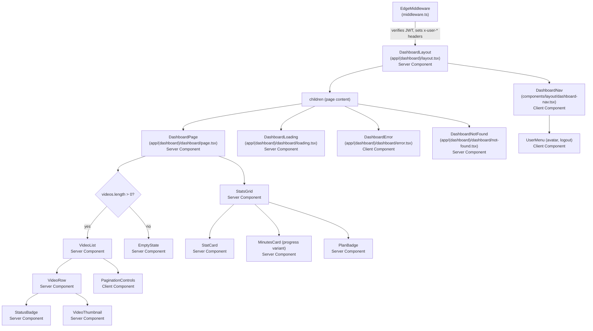

# Dashboard — Architecture

## Overview

The dashboard is the primary authenticated screen of КлипМейкер, displaying usage statistics, video list with pagination, and navigation. This document defines the component hierarchy, data flow, auth integration, and file structure for enhancing the existing dashboard implementation.

---

## Component Hierarchy



---

## Data Flow

```
Request
  │
  ▼
┌─────────────────────────────────────────────────────────────────┐
│ Edge Middleware (middleware.ts)                                  │
│  1. Read `access_token` cookie                                  │
│  2. Verify JWT signature with jose (Edge-compatible)            │
│  3. Set headers: x-user-id, x-user-email, x-user-plan       │
│  4. If invalid/missing → redirect /login                        │
└──────────────────────┬──────────────────────────────────────────┘
                       │ headers forwarded
                       ▼
┌─────────────────────────────────────────────────────────────────┐
│ DashboardLayout (Server Component)                              │
│  1. Read `access_token` cookie via cookies() from next/headers  │
│  2. Decode JWT with jose jwtVerify() to extract user payload    │
│  3. If missing or decode fails → redirect('/login')             │
│  4. Pass user object { id, email, planId } to DashboardNav      │
│  5. Render children                                             │
└──────────────────────┬──────────────────────────────────────────┘
                       │
                       ▼
┌─────────────────────────────────────────────────────────────────┐
│ DashboardPage (Server Component)                                │
│  1. Read x-user-id from headers()                               │
│  2. Parse searchParams.page (default 1)                         │
│  3. Execute parallel Prisma queries via Promise.all:             │
│     - user (minutes, plan, subscription.currentPeriodEnd)        │
│     - videoCount                                                │
│     - clipCount                                                 │
│     - videos (take 11, skip offset, with clips._count)          │
│  4. Compute hasMore = videos.length > 10                        │
│  5. Render StatsGrid + VideoList or EmptyState                  │
└─────────────────────────────────────────────────────────────────┘
```

### Why layout reads the cookie directly

The Edge middleware already verifies the JWT and sets `x-user-*` headers. However, the layout needs the full user payload (including planId and email) for the `DashboardNav` component. Rather than depending on `getServerSession(authOptions)` (which requires NextAuth server-side config and database calls), we decode the same JWT cookie using `jose` — the same library the middleware uses. This is:

- **Consistent** with the existing auth pattern (JWT cookies, not session DB).
- **Edge-compatible** (jose works in Edge runtime).
- **Zero-latency** — no database round-trip for auth check.
- **Self-contained** — no dependency on NextAuth internals.

---

## File Structure Plan

### Files to Create

| File | Type | Purpose |
|------|------|---------|
| `apps/web/app/(dashboard)/dashboard/loading.tsx` | Server Component | Skeleton UI while dashboard page streams |
| `apps/web/app/(dashboard)/dashboard/error.tsx` | Client Component (`'use client'`) | Error boundary with retry |
| `apps/web/app/(dashboard)/dashboard/not-found.tsx` | Server Component | 404 state for dashboard |
| `apps/web/app/(dashboard)/dashboard/upload/loading.tsx` | Server Component | Skeleton for upload page |
| `apps/web/app/(dashboard)/dashboard/upload/error.tsx` | Client Component | Error boundary for upload |
| `apps/web/app/(dashboard)/dashboard/videos/[id]/loading.tsx` | Server Component | Skeleton for video detail |
| `apps/web/app/(dashboard)/dashboard/videos/[id]/error.tsx` | Client Component | Error boundary for video detail |
| `apps/web/app/(dashboard)/dashboard/videos/[id]/not-found.tsx` | Server Component | 404 for nonexistent video |
| `apps/web/components/dashboard/stats-grid.tsx` | Server Component | Stats cards container |
| `apps/web/components/dashboard/stat-card.tsx` | Server Component | Individual stat card (value + label) |
| `apps/web/components/dashboard/minutes-card.tsx` | Server Component | Minutes usage with progress bar |
| `apps/web/components/dashboard/plan-badge.tsx` | Server Component | Plan name badge with color |
| `apps/web/components/dashboard/video-list.tsx` | Server Component | Video rows + pagination |
| `apps/web/components/dashboard/video-row.tsx` | Server Component | Single video row |
| `apps/web/components/dashboard/status-badge.tsx` | Server Component | Localized status label + color |
| `apps/web/components/dashboard/video-thumbnail.tsx` | Server Component | Thumbnail with fallback |
| `apps/web/components/dashboard/pagination-controls.tsx` | Client Component | Page navigation (prev/next) |
| `apps/web/components/dashboard/empty-state.tsx` | Server Component | CTA when no videos exist |
| `apps/web/components/dashboard/dashboard-skeleton.tsx` | Server Component | Skeleton cards + rows |

### Files to Modify

| File | Change |
|------|--------|
| `apps/web/app/(dashboard)/layout.tsx` | Replace `getServerSession(authOptions)` with `cookies()` + `jwtVerify()` from jose. Remove NextAuth import. Pass decoded user to DashboardNav. |
| `apps/web/components/layout/dashboard-nav.tsx` | Replace NextAuth `signOut()` with custom `handleLogout()` that calls `POST /api/auth/logout` then redirects. Accept `user` prop instead of `useSession()`. |
| `apps/web/app/(dashboard)/dashboard/page.tsx` | Replace current implementation with parallel Prisma queries, enhanced StatsGrid, paginated VideoList, and EmptyState. |

---

## Auth Integration Approach

### Layout: Replace getServerSession

**Current (broken):**
```
import { getServerSession } from 'next-auth'
import { authOptions } from '@/lib/auth'

// Depends on NextAuth — project uses custom JWT cookies
const session = await getServerSession(authOptions)
```

**New:**
```
import { cookies } from 'next/headers'
import { jwtVerify } from 'jose'

const accessToken = cookies().get('access_token')?.value
if (!accessToken) redirect('/login')

const { payload } = await jwtVerify(accessToken, secret)
const user = { id: payload.sub, email: payload.email, planId: payload.planId }
```

The JWT secret is read from `process.env.NEXTAUTH_SECRET` and encoded as `TextEncoder().encode(secret)` for jose compatibility. This is the same approach used in `middleware.ts`.

### DashboardNav: Replace signOut

**Current (broken):**
```
import { signOut } from 'next-auth/react'
onClick={() => signOut({ callbackUrl: '/login' })}
```

**New:**
```
async function handleLogout() {
  await fetch('/api/auth/logout', { method: 'POST' })
  window.location.href = '/login'
}
```

The `/api/auth/logout` endpoint already exists and clears the `access_token` and `refresh_token` cookies.

---

## Server Components vs Client Components

| Component | Rendering | Justification |
|-----------|-----------|---------------|
| DashboardLayout | Server | Reads cookies, no interactivity |
| DashboardPage | Server | Runs Prisma queries, streams to client |
| StatsGrid, StatCard, MinutesCard, PlanBadge | Server | Pure display, no state |
| VideoList, VideoRow, StatusBadge, VideoThumbnail | Server | Pure display, data from parent |
| EmptyState | Server | Static content with link |
| DashboardNav | **Client** | Dropdown menu, logout handler, interactive |
| PaginationControls | **Client** | onClick navigation with `useRouter().push()` |
| DashboardError | **Client** | Required by Next.js (`error.tsx` must be client) |
| DashboardLoading | Server | Static skeleton markup |

**Principle:** Default to Server Components. Only use `'use client'` for interactivity (event handlers, hooks, browser APIs). This minimizes the JS bundle sent to the client and allows Prisma queries directly in components.

---

## Loading / Error Boundary Strategy

Each route segment gets its own `loading.tsx` and `error.tsx`:

```
app/(dashboard)/
├── layout.tsx                         # Auth gate — redirect on failure
├── dashboard/
│   ├── page.tsx                       # Main dashboard
│   ├── loading.tsx                    # Skeleton: 4 stat cards + 5 video rows
│   ├── error.tsx                      # "Произошла ошибка" + retry button
│   ├── not-found.tsx                  # "Страница не найдена"
│   ├── upload/
│   │   ├── page.tsx
│   │   ├── loading.tsx                # Upload form skeleton
│   │   └── error.tsx                  # Upload error boundary
│   └── videos/[id]/
│       ├── page.tsx
│       ├── loading.tsx                # Video detail skeleton
│       ├── error.tsx                  # Video error boundary
│       └── not-found.tsx              # "Видео не найдено"
```

### Behavior

- **loading.tsx**: Next.js wraps the page in a `<Suspense>` boundary with `loading.tsx` as the fallback. This enables instant navigation with streaming. Skeletons match the final layout to prevent layout shift.
- **error.tsx**: Must be a Client Component (`'use client'`). Catches runtime errors in the segment. Shows localized error message and a "Попробовать снова" (retry) button that calls `reset()`.
- **not-found.tsx**: Displayed when `notFound()` is thrown from the page. Shows localized message and a link back to dashboard.

### Error hierarchy

Errors bubble up through the boundary tree. A video detail error is caught by `videos/[id]/error.tsx`. If that boundary itself fails, it bubbles to `dashboard/error.tsx`. The layout is always rendered (it is outside the error boundary), so navigation remains functional even during errors.

---

## Performance Considerations

### Parallel Prisma Queries

The dashboard page runs 4 queries. All are independent and execute in parallel via `Promise.all`:

```
[user, videoCount, clipCount, videos] = await Promise.all([...])
```

This reduces total query time from sequential (sum of all) to parallel (max of all). Typical dashboard load: ~50-80ms for all 4 queries combined.

### Skeleton Streaming

With `loading.tsx`, Next.js streams the shell immediately while the page component awaits data. The user sees the skeleton within ~50ms of navigation, and the real content replaces it once queries complete. No blank screen.

### Pagination Over Infinite Scroll

Page-based pagination (with `skip`/`take`) was chosen over cursor-based infinite scroll because:

1. **Server Component compatible** — no client state needed, page number comes from `searchParams`.
2. **URL-shareable** — `?page=3` is bookmarkable and works with back/forward.
3. **Predictable performance** — fixed page size (10 items) means consistent query time.
4. **SEO-friendly** — each page is a distinct URL.

The `tRPC video.list` already supports cursor-based pagination. The page component uses simple offset pagination via Prisma directly (not tRPC) since it is a Server Component with direct database access.

### Video Thumbnails

Thumbnails are served from S3 with a predictable path pattern (`/thumbnails/{videoId}.jpg`). The `VideoThumbnail` component uses `next/image` with `sizes` and `placeholder="blur"` for optimal loading. A fallback SVG icon is shown if the thumbnail does not exist (via `onError` or a default).

---

## Dependencies

| Dependency | Version | Purpose | Already installed? |
|------------|---------|---------|-------------------|
| jose | ^5.x | JWT verification in layout (Edge-compatible) | Yes (used in middleware.ts) |
| next | 15.x | App Router, Server Components, streaming | Yes |
| @prisma/client | ^6.x | Database queries | Yes |
| tailwindcss | ^4.x | Styling, skeleton animations | Yes |
| lucide-react | ^0.x | Icons for stats, empty state, errors | Yes |

No new dependencies are required.
