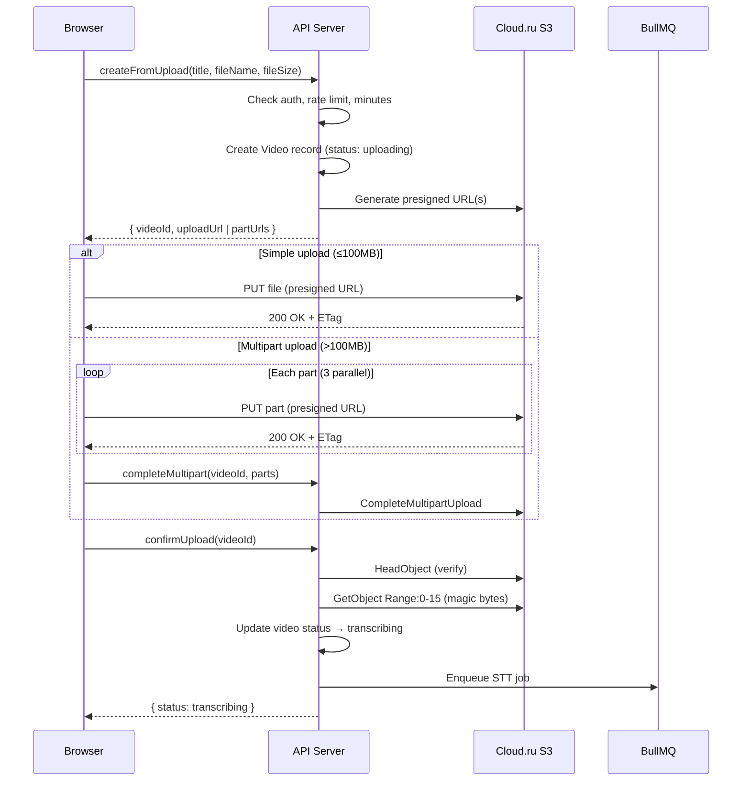

# Architecture: S3 Upload

## Architecture Overview

The S3 integration follows the **presigned URL pattern** — browser uploads directly to Cloud.ru S3, bypassing the API server for data transfer. The API server only handles metadata, authorization, and pipeline orchestration.



## Component Breakdown

### New: `packages/s3`

```
packages/s3/
├── src/
│   ├── index.ts          # Public exports
│   ├── client.ts         # S3Client singleton factory
│   ├── config.ts         # S3 configuration from env
│   ├── presign.ts        # Presigned URL generation (upload + download)
│   ├── multipart.ts      # Multipart upload helpers
│   ├── operations.ts     # headObject, getObjectBytes, deleteObject
│   ├── paths.ts          # S3 key builders (videoSource, clip, thumbnail)
│   └── validation.ts     # Magic bytes validation
├── package.json
└── tsconfig.json
```

### Modified: `apps/web/lib/trpc/routers/video.ts`

- `createFromUpload` — generate presigned URL, set `filePath` to S3 key
- `completeMultipart` — new: complete multipart upload
- `confirmUpload` — new: verify file, validate format, trigger pipeline

### Modified: `apps/web/lib/trpc/routers/clip.ts`

- `download` — new: generate presigned download URL

### Modified: `apps/web/components/upload/video-uploader.tsx`

- Add upload execution (XHR/fetch to presigned URL)
- Add progress bar with percentage, speed, ETA
- Add cancel button
- Handle multipart upload flow
- Add magic bytes client-side pre-check

## Technology Stack

| Component | Technology | Rationale |
|-----------|-----------|-----------|
| S3 SDK | `@aws-sdk/client-s3` v3 | Official AWS SDK, Cloud.ru compatible |
| Presigner | `@aws-sdk/s3-request-presigner` | Standard presigned URL generation |
| Upload transport | XMLHttpRequest | `upload.onprogress` for progress tracking (fetch API lacks this) |
| File slicing | `File.slice()` | Native browser API for multipart chunks |

## Data Architecture

### S3 Bucket Structure
```
clipmaker-storage/
├── videos/
│   └── {userId}/
│       └── {videoId}/
│           └── source.{ext}        # Original uploaded video
├── clips/
│   └── {userId}/
│       └── {videoId}/
│           └── {clipId}.mp4        # Rendered clip
└── thumbnails/
    └── {userId}/
        └── {videoId}/
            └── {clipId}.jpg        # Clip thumbnail
```

### Database Changes
No schema changes needed. Existing fields used:
- `Video.filePath` — stores S3 key (e.g., `videos/uuid/uuid/source.mp4`)
- `Video.status` — `uploading` → `transcribing` flow
- `Clip.filePath` — stores S3 key for rendered clips

### Environment Variables (new)
```
S3_ENDPOINT=https://s3.cloud.ru
S3_REGION=ru-central-1
S3_ACCESS_KEY_ID=<tenant_id>:<key_id>
S3_SECRET_ACCESS_KEY=<secret>
S3_BUCKET_NAME=clipmaker-storage
```

## Security Architecture

### Presigned URL Security
- **Upload URLs:** 1-hour expiry, Content-Length constraint matches declared fileSize
- **Download URLs:** 1-hour expiry, only generated for clip owner
- **Server-side validation:** Magic bytes check prevents uploading non-video files
- **S3 credentials:** Server-side only, never exposed to browser

### CORS Configuration
Required on the S3 bucket for browser direct upload:
```json
{
  "CORSRules": [{
    "AllowedOrigins": ["https://clipmaker.ru", "http://localhost:3000"],
    "AllowedMethods": ["PUT", "GET", "HEAD"],
    "AllowedHeaders": ["*"],
    "ExposeHeaders": ["ETag"],
    "MaxAgeSeconds": 3600
  }]
}
```

### Rate Limiting
- 10 uploads per hour per user (existing `checkRateLimit` from auth module)
- Applied in `createFromUpload` before generating presigned URL

## Integration Points

### With STT Worker
After `confirmUpload`, the STT job is enqueued with:
```typescript
{ videoId, userId, filePath: video.filePath, strategy: video.llmProviderUsed }
```
Worker reads video from S3 using `filePath` key.

### With Video Render Worker
After FFmpeg renders a clip, worker writes result to S3:
```typescript
const clipKey = clipPath(userId, videoId, clipId);
await putObject(clipKey, renderedBuffer, 'video/mp4');
await db.clip.update({ where: { id: clipId }, data: { filePath: clipKey, status: 'ready' } });
```

### With Publish Worker
Publish worker reads clip from S3 before uploading to platform:
```typescript
const clipData = await getObject(clip.filePath);
await platformProvider.publish(clipData, clip.title);
```

## Consistency with Project Architecture

- **Monorepo package:** `packages/s3` follows same pattern as `packages/db`, `packages/queue`
- **tRPC integration:** New procedures added to existing routers
- **BullMQ integration:** `confirmUpload` enqueues to existing `stt` queue
- **Docker Compose:** S3 credentials added to `web` and `worker-*` services
- **No new services:** S3 is external (Cloud.ru), no new Docker containers
