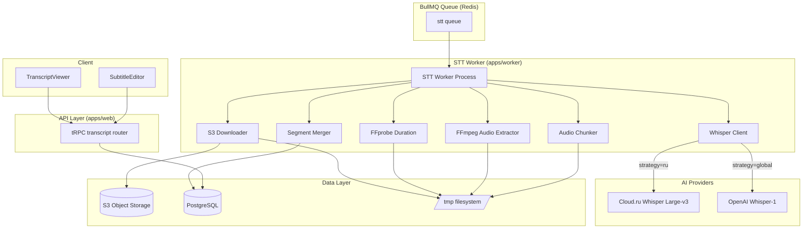

# STT + Subtitles — Architecture

## Component Diagram



## File Structure

```
apps/worker/
├── workers/
│   └── stt.ts              # STT worker (REWRITE — replace placeholder)
├── lib/
│   ├── llm-router.ts       # Existing — use transcribe() method
│   ├── ffmpeg.ts            # Existing — add ffprobeGetDuration(), extractAudio()
│   ├── s3-download.ts       # NEW — downloadFromS3() helper
│   └── audio-chunker.ts     # NEW — splitAudio(), CHUNK_DURATION constant
│   └── logger.ts            # Existing — no changes

apps/web/
├── lib/trpc/routers/
│   └── transcript.ts        # NEW — getSegments, updateSegments, getFullText
│   └── index.ts             # UPDATE — add transcriptRouter
├── components/
│   └── transcript/
│       ├── transcript-viewer.tsx  # NEW — timed segment list
│       └── segment-editor.tsx     # NEW — inline edit per segment
├── app/(dashboard)/dashboard/videos/[id]/
│   └── page.tsx             # UPDATE — add TranscriptViewer

packages/s3/
├── src/
│   └── operations.ts        # Existing — add getObjectStream() for download
│   └── index.ts             # UPDATE — export getObjectStream
```

## Technology Choices

| Component | Technology | Rationale |
|-----------|-----------|-----------|
| STT (RU strategy) | Cloud.ru Whisper Large-v3 | 0.30₽/min, data in RF, OpenAI-compatible |
| STT (Global strategy) | OpenAI Whisper-1 | Standard, reliable, well-documented |
| Audio extraction | FFmpeg subprocess | Already in project (ffmpeg.ts), proven |
| Audio format | WAV 16kHz mono PCM | Whisper's native format, no compression artifacts |
| Chunking | FFmpeg segment | Simple, reliable, exact split points |
| Concurrency | p-map (npm) | Proven concurrency limiter, simple API |
| Temp storage | /tmp + mkdtemp | Isolated per job, cleaned in finally |
| Transcript storage | PostgreSQL JSON column | Already in schema (segments: Json) |
| Real-time updates | Existing polling or future WebSocket | Video detail page polls status |

## Integration Points

### 1. S3 Download (packages/s3)
New export: `getObjectStream(key)` → returns `Readable` stream for piping to file.

### 2. STT Queue (packages/queue)
Already defined: `QUEUE_NAMES.STT = 'stt'`, `STTJobData` type.
Job is enqueued by `video.confirmUpload` mutation (existing code).

### 3. LLM Router (apps/worker/lib/llm-router.ts)
Existing `transcribe()` method on `LLMRouter` class. Needs update: accept `ReadStream` instead of `File | Buffer`. Cloud.ru and OpenAI SDK both accept `ReadStream` via `Uploadable` type.

### 4. Video Status
STT worker transitions `video.status`:
- Input: `'transcribing'` (set by confirmUpload)
- Success output: `'analyzing'`
- Error output: `'failed'`

### 5. tRPC Router Registration
`transcriptRouter` added to `apps/web/lib/trpc/routers/index.ts` alongside `videoRouter` and `clipRouter`.

## Security Considerations

| Concern | Mitigation |
|---------|-----------|
| FFmpeg command injection | Use `execFile()` (array args), never `exec()` with string interpolation |
| /tmp file disclosure | `mkdtemp()` with random suffix, mode 0o700, cleanup in finally |
| S3 key traversal | Validated by `packages/s3/paths.ts` (existing) |
| Transcript edit XSS | Zod validation: text min 1 / max 1000. No HTML in segments |
| Unauthorized transcript access | All tRPC procedures check `userId` ownership |
| API key exposure | Cloud.ru key is server-side env only. OpenAI key same |

## Scalability

| Dimension | Current (MVP) | Scale Path |
|-----------|--------------|------------|
| Concurrency | 2 workers, 3 chunks parallel | Increase worker replicas |
| File size | Up to 4GB video | Stream download, chunk on-the-fly |
| API rate | 15 req/sec (Cloud.ru) | Queue-based natural backpressure |
| Storage | /tmp per-job | tmpfs mount with memory limit |
| Cost | 0.30₽/min (Cloud.ru) | Self-host Whisper at scale |
